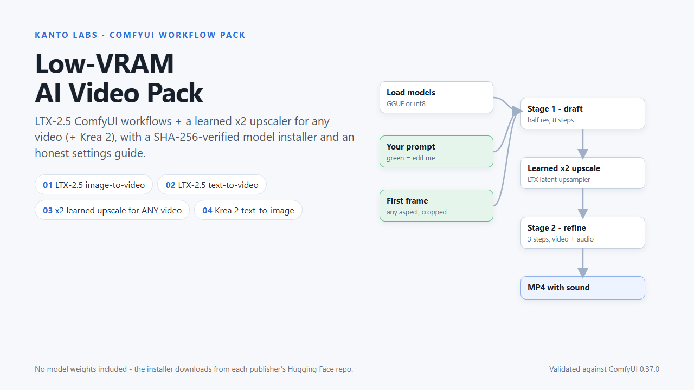
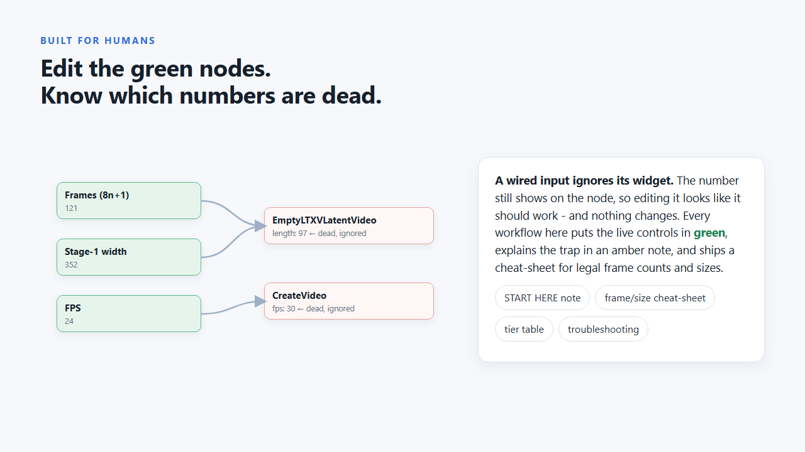
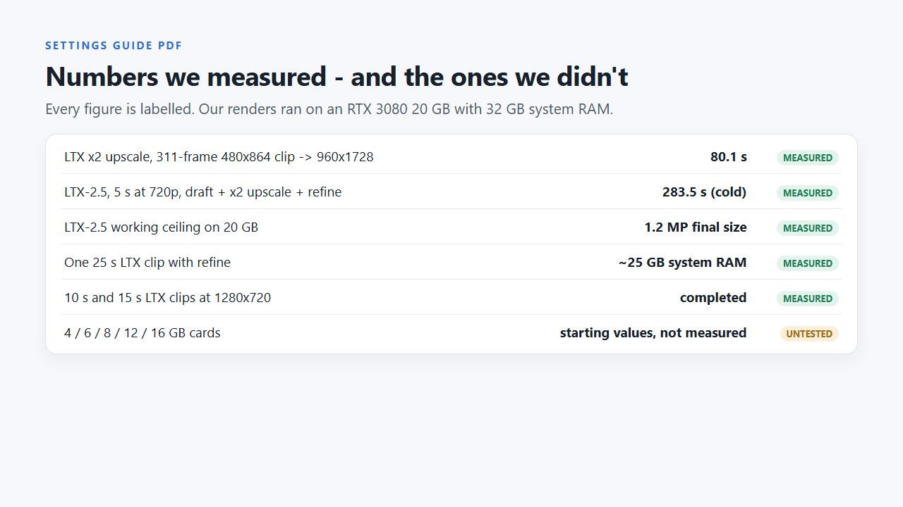
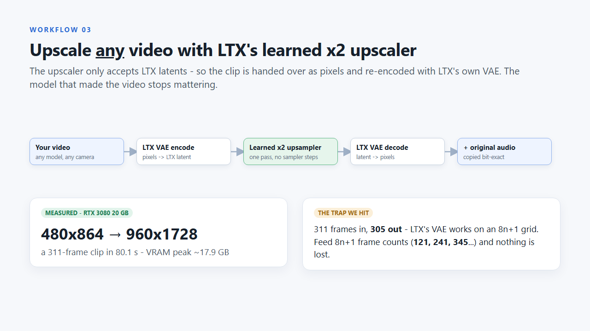

# LTX-2.5 ComfyUI Workflow for Low VRAM: Free Text-to-Video with Sound (Draft + Learned x2 Upscale + Refine)

A free, clean **LTX-2.5 text-to-video workflow for ComfyUI**, built from scratch for consumer GPUs.
It uses LTX-2.5's two-stage recipe: a half-resolution **8-step draft**, LTX's **learned x2 latent
upscaler**, and a **3-step refine** pass. Picture **and soundtrack** come out of one run. A GGUF model
loader keeps VRAM use down, and `install_models.py` downloads every model from its publisher and
checks its SHA-256.



> **Status, stated plainly:** this graph type was render-tested on an **RTX 3080 20 GB with 32 GB system
> RAM**, and the file is structure-validated against **ComfyUI 0.37.0**. It has **not** been tested on
> smaller cards. No model weights are included.

## What's in this repo

| file | what it does |
|---|---|
| `LITE_LTX25_Text_to_Video.json` | The ComfyUI workflow. Drag it onto the canvas. |
| `install_models.py` | Downloads the models from the publishers' Hugging Face repos into the right ComfyUI folders; verifies exact size + SHA-256; resumes interrupted downloads. Python 3.8+, standard library only. |
| `THIRD_PARTY.md` | Every node pack and model the workflow uses, with its licence in plain English. |
| `LICENSE` | MIT (for the files written by us). |

## Quick start

1. **ComfyUI 0.37.0 or newer** (LTX-2.5 support is built in) plus the free
   [ComfyUI-GGUF](https://github.com/city96/ComfyUI-GGUF) node pack (Apache-2.0).
   Restart the ComfyUI process after installing it - a browser refresh is not enough.
2. **Models (about 31 GB).** LTX-2.5 is gated: log in at
   [huggingface.co/Lightricks/LTX-2.5](https://huggingface.co/Lightricks/LTX-2.5), accept the licence and
   create a read token. Then:
   ```bash
   python install_models.py --comfy "C:/path/to/ComfyUI" --list          # sizes + licences first
   python install_models.py --comfy "C:/path/to/ComfyUI" --workflow 02 --token hf_xxx
   ```
3. **Drag `LITE_LTX25_Text_to_Video.json` onto the ComfyUI canvas.** Edit only the **green** nodes
   (prompt, stage-1 width/height, frames, FPS) and queue.

## Edit the green nodes: the linked-widget trap



In ComfyUI, **a widget whose input has a wire plugged into it is ignored.** The number still shows on
the node, so editing it looks like it should work, and nothing changes. In this workflow the numbers
printed on `EmptyLTXVLatentVideo`, `LTXVEmptyLatentAudio`, `LTXVConditioning` and `CreateVideo` are
dead: size, length and FPS come from the green primitives. Change those instead.

## Frame counts and sizes (cheat-sheet)

LTX-2.5 wants **8n+1 frames**. Any other number is snapped by the model, and the audio length can drift.

| seconds @ 24 fps | frames |
|---|---|
| 3 | 73 |
| 5 | 121 |
| 8 | 193 |
| 10 | 241 |
| 15 | 361 |
| 20 | 481 |

The final size is **exactly 2x the stage-1 size**, and stage-1 sides must be multiples of 32:

| stage 1 | final | note |
|---|---|---|
| 352x640 | 704x1280 | 9:16, ~0.9 MP |
| 416x736 | 832x1472 | 9:16, ~1.2 MP |
| 640x352 | 1280x704 | 16:9, ~0.9 MP |
| 736x416 | 1472x832 | 16:9, ~1.2 MP |

## Numbers we measured (RTX 3080 20 GB, 32 GB system RAM)



- 5 s at 1280x720 with audio, draft + x2 upscale + refine: **283.5 s** wall time, cold start (model load included).
- 10 s and 15 s clips at 1280x720 completed. **1.2 MP final is our working ceiling on 20 GB**; a 2.0 MP final
  spilled 9.5 GB to system RAM, ran about 6x slower per step, then ComfyUI crashed on the next model load.
- One 25-second (601-frame) clip with the refine pass used **about 25 GB of system RAM**.

Numbers for 4-16 GB cards: **not measured** by us.

## FAQ

**Does it run on 8 GB or 12 GB VRAM?**
We have not tested it on those cards, so we won't claim it. On low-VRAM cards the model moves to
system RAM, and that is usually the real limit: plan on 32 GB of system RAM, start small (stage-1
352x640, 121 frames or fewer) and raise one thing at a time.

**Why does my render fail with `WinError 1450` / `HostBuffer ... failed` / `not enough memory`?**
That is system RAM, not VRAM. Close the browser and other apps, restart ComfyUI, and shorten the clip.

**Why does the negative prompt do nothing?**
The distilled model runs at cfg 1.0, where the negative branch cancels out. Raising cfg is not the
fix (we tried 3.0/7.0 and the look got markedly worse). Steer with the positive prompt and the seed.

**Changing a number on a node does nothing.**
That input is wired from a green primitive (see the linked-widget trap above). Edit the primitive.

**A run "finished" in 0.01 s.**
ComfyUI returned a cached result for an identical prompt. Change the seed.

**Can I use the videos commercially?**
The LTX-2.x Community License allows commercial use under $10M annual revenue and requires published
outputs to be disclosed as machine-generated. Read the licence itself - `THIRD_PARTY.md` links it.

## Full version: Low-VRAM AI Video Pack

This repo is the free sample. The **[Low-VRAM AI Video Pack](https://kantolabs.gumroad.com/l/fjnpqn)**
($19) adds:

- **LTX-2.5 image-to-video** (first frame + prompt -> video with sound; the first frame is re-baked after
  the upscale so faces don't drift),
- **x2 learned upscale for ANY video**: hand any clip to LTX's trained upscaler through LTX's own VAE;
  original audio copied back bit-exact (measured: a 311-frame 480x864 clip -> 960x1728 in 80.1 s),
- **Krea 2 Turbo text-to-image** for first frames (structure-validated, not yet render-tested),
- the **Settings Guide PDF**: settings by VRAM tier (untested tiers labelled as such), system-RAM planning,
  measured timings and a troubleshooting table of real error messages.



---

Made by **Kanto Labs** - [kantolabs.pages.dev](https://kantolabs.pages.dev/). Not affiliated with
Lightricks or Comfy-Org. Node, model and product names belong to their owners.
